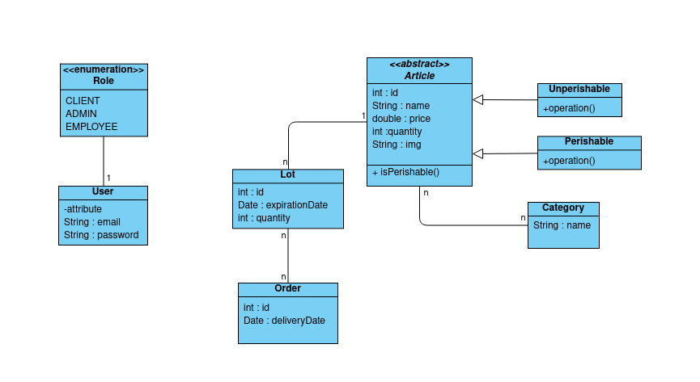

# Référencement de produits et stock
Rémi DEWAME  
Ayoub Lahouaichri  
Geoffrey Herman  
Gaëlle Fret  

## Introduction
Ce projet a pour but de développer une application visant à simplifier la gestion des produits et des stocks, offrant aux administrateurs et aux employés des outils efficaces 
pour maintenir un inventaire précis et garantir que seuls les produits disponibles et sûrs sont proposés aux clients. Les fonctionnalités clés incluent la gestion des produits, la gestion des stocks, la gestion des produits périssables, la surveillance des dates de péremption et la facilitation des retours de produits. 
Les clients bénéficient également d'une expérience de commande sécurisée, en ne pouvant commander que des produits en stock et dont la date de péremption dépasse 5 jours.

Pour le développement, nous utiliserons du Vue.js pour le front avec la libraire Vuetify, pour ce qui est du back nous utiliserons SpringBoot.
La compilation sera effectuée à l'aide de Maven. Un fichier pom.xml sera fourni pour faciliter la compilation.

Liens :
* [Cahier des charges](doc/cahier_des_charges.md)
* [Diagramme de classe UML](doc/diag-uml.png)

## Installation
:warning: L'application nécessite Maven.  
:warning: Pour l'installation, consulter la page officielle de [Maven](https://maven.apache.org/install.html)

### Récupération du dépôt :

* Exécuter la commande suivante pour récupérer le dépôt :
  ```bash
  git clone https://gitlab.univ-lille.fr/SRA1-2023/Classroom-SRA1-2023/projects/eservices-g-referencement.git
  ```

### Compilation du projet maven :

* Se placer à la racine du répertoire et exécuter la commande suivante :
  ```bash
  mvn compile
  ```

### Génération de l'archive du projet :

* Se placer à la racine du dépôt et exécuter la commande suivante :
  ```bash
  mvn jar:jar
  ```

### Exécution de l'archive générée :

* Pour exécuter l'application et exécuter la commande suivante :

  ```bash
  java -jar target/
  ```

### Exécution des tests :

* Se placer à la racine du dépôt et exécuter la commande suivante :
  ```bash
  mvn test
  ```

### Génération de la documentation :

* Se placer à la racine du dépôt et exécuter la commande suivante :
  ```bash
  mvn javadoc:javadoc 
  ```


###  Nettoyage du projet :

* Se placer à la racine du dépôt et exécuter la commande suivante :
    ```bash
    mvn clean
    ```

### Package :

* Se placer à la racine du dépôt et exécuter la commande suivante regroupant toutes les commandes précédentes (hors javadoc) :
  ```bash
  mvn package
  ```


## Architecture
## Diagramme de classe UML


*Diagramme créé sur [online.visual-paradigm](https://online.visual-paradigm.com/)*

## Sujet
### En tant qu'administrateur je peux gérer les produits de ma base article.
Une page de recherche me propose des critères de recherche : catégorie (sous la forme d'une liste déroulante), un texte contenu dans le nom du produit, la référence exacte du produit.
Je peux saisir un ou plusieurs critères de recherche, une liste paginée me propose les produits correspondants à ces critères.
Je peux choisir de paginer les produits par 10, 50 ou 200.
La liste se présentera sous la forme d'un tableau présentant la référence, le nom, le prix du produit.
En cliquant sur un produit un formulaire me permet de modifier l'ensemble des informations du produit.
Je peux ajouter un produit via un lien "Nouveau" présent sur la liste et me présentant un formulaire vierge pour saisir toutes les informations du produit.

### En tant qu'administrateur je peux gérer les stocks de mes produits afin de ne présenter sur le site que les produits en stock.
Ajouter une information de stock sur les produits permettant de gérer les produits classique (n'ayant pas de date de péremption) et les produits périssable.
Attention, les stocks des produits périssables devront être distingués par date de péremption.
Modifiez les écrans de saisie des produits classiques pour permettre la saisie et la modification rapide des stocks.

### En tant qu'administrateur je peux enregistrer un arrivage de denrées périssables.
Une page dédiée me permet de saisir la référence d'un produit périssable, la date limite de consommation, le lot, la quantité reçue.
Ajoutez une entrée de stock pour cet arrivage.
Il faudra peut-être modifier votre modèle pour pouvoir avoir plusieurs stocks d'un même produit périssable.

### En tant qu'administrateur je peux voir les produits dont la DLC (date limite de consommation) est dépassée.
Une page dédiée me permet de voir toutes les entrées de stock pour lesquelles la date de consommation est dépassée.
Je peux supprimer cette entrée de stock afin d'indiquer que j'ai jeté les produits concernés.

### En tant qu'employé je peux ajuster le stock d'un produit à partir de la liste d'une commande.
Une page présentant la liste des articles d'une commande retrouvée par son numéro permet à l'employé de remettre en stock un produit qui serait finalement refusé par le client à la livraison, ou qui serait retourné non déballé dans les 7 jours.
Les refus de produits périssables ne génèrent pas de rajout au stock, ils sont simplement considérés détruits.
Un retour de produit ne peut être enregistré que si la date de retrait est inférieure à 7 jours.

### En tant que client je ne peux commander que des produits encore en stock et dont la durée de péremption est supérieure à 5 jours.
Modifiez la présentation des produits par catégories pour n'afficher que les produits en stock (produits standards).
Seuls les produits périssables dont la date de consommation d'une entrée de stock est supérieure à 5 jours seront affichés.
Lors de la validation de commande, veuillez enregistrer les variations de stocks pour impacter les quantités restantes.
